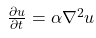
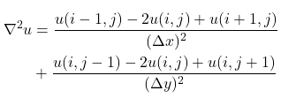
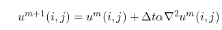
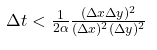

## Heat equation solver parallelized with OpenMP

A two dimensional heat equation solver has been implemented without any
parallelisation (= serial version) in both [C](c/) and [Fortran](fortran/).

 * Parallelize the serial heat equation solver with OpenMP by parallelizing
   the loops in the routines for data initialization (`initialize`) and time
   evolution (`evolve`).

 * Improve the OpenMP parallelization such that the parallel region is opened
   and closed only once during the program execution.

An initial temperature field is available in the file
[common/bottle.dat](common/bottle.dat) (the file consists of a header and 200
x 200 data array). Boundaries are fixed a to constant value.

### Theory: Two dimensional heat equation

Heat (or diffusion) equation is

<!-- Equation
\frac{\partial u}{\partial t} = \alpha \nabla^2 u
-->

where **u(x, y, t)** is the temperature field that varies in space and time,
and α is thermal diffusivity constant. The two dimensional Laplacian can be
discretized with finite differences as

<!-- Equation
\begin{align*}
\nabla^2 u  &= \frac{u(i-1,j)-2u(i,j)+u(i+1,j)}{(\Delta x)^2} \\
 &+ \frac{u(i,j-1)-2u(i,j)+u(i,j+1)}{(\Delta y)^2}
\end{align*}
-->

Given an initial condition (u(t=0) = u0) one can follow the time dependence of
the temperature field with explicit time evolution method:

<!-- Equation
u^{m+1}(i,j) = u^m(i,j) + \Delta t \alpha \nabla^2 u^m(i,j)
-->

Note: Algorithm is stable only when

<!-- Equation
\Delta t < \frac{1}{2 \alpha} \frac{(\Delta x \Delta y)^2}{(\Delta x)^2 (\Delta y)^2}
-->

